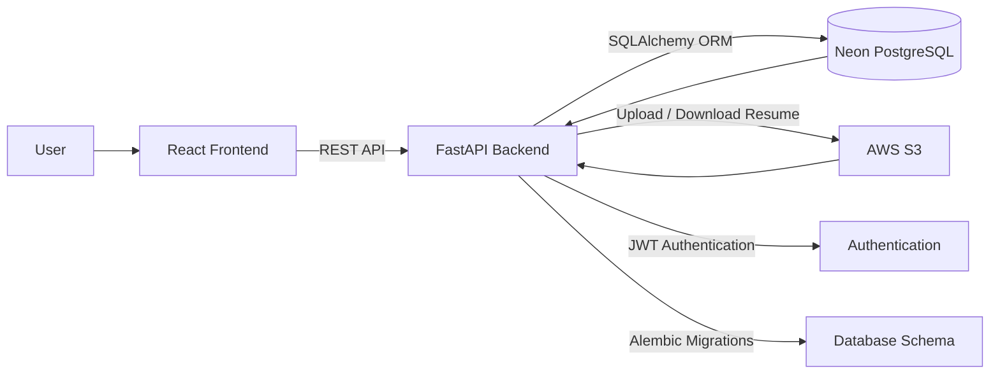

# Job Application Tracker

Job Application Tracker is a web application that helps users organize and manage their job applications in one place. 
Instead of tracking applications through spreadsheets or notes, users can store details such as the company, role, application status, deadlines, notes, and resumes in a single application.
It provides an easy way to keep track of the application process, stay organized, and monitor progress throughout the job search.

###  Application Link 
[job-application-tracker](https://job-application-tracker-frontend-one.vercel.app/login)

###  API Documentation 
[FastAPI-Documentation](https://job-application-tracker-backend-ykfi.onrender.com/docs)

## Application Preview 

###  Home Page :

<table>
  <tr>
    <td>
      
    </td>
  </tr>
</table>

###  Dashboard Page 

  <tr>
    <td>
      
    </td>
  </tr>
</table>

##  Features

- **Secure Authentication** – User registration and login using JWT-based authentication.
- **Application Management** – Create, view, update, and delete job applications.
- **Search & Filter** – Search applications by company, role, or application status.
- **Sorting** – Sort applications by company, role, status, applied date, or deadline.
- **Pagination** – Browse large numbers of applications efficiently with server-side pagination.
- **Dashboard Overview** – View application statistics, recent applications, and upcoming deadlines.
- **Status History** – Track every application status change with timestamps.
- **Resume Management** – Upload, replace, download, and automatically delete resumes when an application is removed.
- **Notes & Job Links** – Store personal notes and job posting links for each application.
- **Database Migrations** – Manage database schema changes using Alembic.
- **User Notifications** – Display success, error, and validation messages using toast notifications.

##  System Architecture

 

