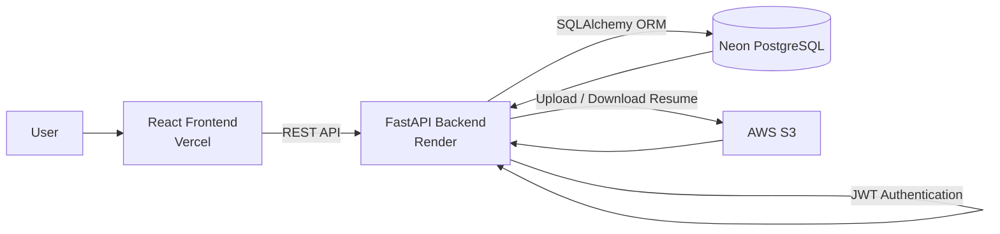

# Job Application Tracker

Job Application Tracker is a web application that helps users organize and manage their job applications in one place. 
Instead of tracking applications through spreadsheets or notes, users can store details such as the company, role, application status, deadlines, notes, and resumes in a single application.
It provides an easy way to keep track of the application process, stay organized, and monitor progress throughout the job search.

###  Application Link 
[job-application-tracker](https://job-application-tracker-frontend-one.vercel.app/login)

###  API Documentation 
[FastAPI-Documentation](https://job-application-tracker-backend-ykfi.onrender.com/docs)

## Application Preview 

###  Home Page :

<table>
  <tr>
    <td>
      
    </td>
  </tr>
</table>

###  Dashboard Page 

  <tr>
    <td>
      
    </td>
  </tr>
</table>

##  Features

- **Secure Authentication** – User registration and login using JWT-based authentication.
- **Application Management** – Create, view, update, and delete job applications.
- **Search & Filter** – Search applications by company, role, or application status.
- **Sorting** – Sort applications by company, role, status, applied date, or deadline.
- **Pagination** – Browse large numbers of applications efficiently with server-side pagination.
- **Dashboard Overview** – View application statistics, recent applications, and upcoming deadlines.
- **Status History** – Track every application status change with timestamps.
- **Resume Management** – Upload, replace, download, and automatically delete resumes when an application is removed.
- **Notes & Job Links** – Store personal notes and job posting links for each application.
- **Database Migrations** – Manage database schema changes using Alembic.
- **User Notifications** – Display success, error, and validation messages using toast notifications.

##  System Architecture



## Tech Stack

| Category | Technologies |
|----------|--------------|
| **Frontend** | React, Vite, Tailwind CSS |
| **Backend** | FastAPI |
| **Database** | PostgreSQL (Neon) |
| **ORM** | SQLAlchemy |
| **Database Migration** | Alembic |
| **Authentication** | JWT |
| **Cloud Storage** | AWS S3 |
| **Deployment** | Vercel (Frontend), Render (Backend) |
| **Version Control** | Git, GitHub |

##  Local Setup

To run the project locally, configure your own PostgreSQL database and AWS S3 bucket, then create the required `.env` files in the backend and frontend directories.

### 1. Clone the Repository

```bash
git clone https://github.com/rahul2k57/job-application-tracker.git
cd job-application-tracker
```

### 2. Backend Setup

```bash
cd backend
python -m venv .venv
source .venv/bin/activate      # macOS/Linux
pip install -r requirements.txt
```

Create a `.env` file inside the **backend** directory:

```env
# Database
DATABASE_URL=<your_postgresql_connection_string>

# JWT Authentication
SECRET_KEY=<your_secret_key>
ALGORITHM=HS256
ACCESS_TOKEN_EXPIRE_MINUTES=30

# AWS S3
AWS_ACCESS_KEY_ID=<your_aws_access_key>
AWS_SECRET_ACCESS_KEY=<your_aws_secret_access_key>
AWS_REGION=<your_aws_region>
AWS_BUCKET_NAME=<your_bucket_name>
PRESIGNED_URL_EXPIRE_SECONDS=3600
```

Run the backend:

```bash
uvicorn app.main:app --reload
```

> **Note**
> - Configure your own PostgreSQL database and AWS S3 bucket before running the project locally.
> - Replace all placeholder values in the `.env` files with your own credentials.
> - Resume upload and download functionality requires a properly configured AWS S3 bucket.

---

### 3. Frontend Setup

```bash
cd frontend
npm install
```

Create a `.env` file inside the **frontend** directory:

```env
VITE_API_BASE_URL=http://localhost:8000
```

Run the frontend:

```bash
npm run dev
```

## Deployment

| Component | Service |
|-----------|---------|
| **Frontend** | Vercel |
| **Backend** | Render |
| **Database** | Neon PostgreSQL |
| **Cloud Storage** | AWS S3 |


 

